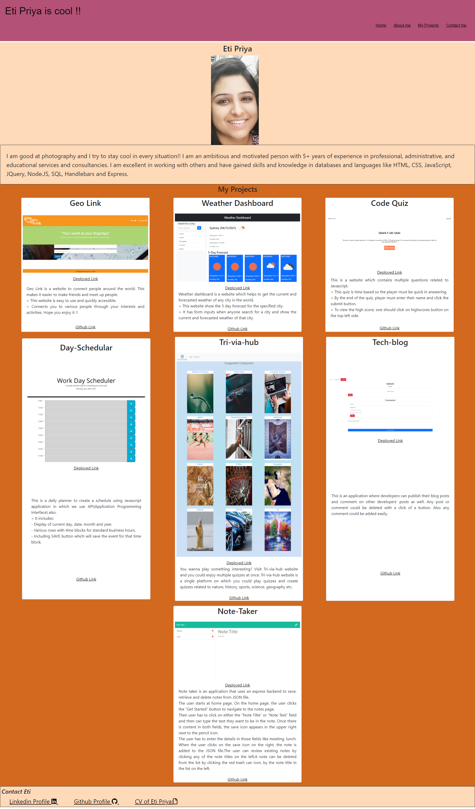

# Portfolio - Eti

Eti Priya is cool !!

I try to stay cool in every situation!!

I am good at clicking photographs.

I am an ambitious and motivated person with 5+ years of experience in professional, administrative, and educational services consultancies. Always like working in a team with good ethical values. Worked in Swaraj Mahindra and learned a lot about managing people and solving their problems.

## Project Link

https://etipriya.github.io/portfolio_eti/

## Description

- This project is the first attempt to display my skills and knowledge in Visual Studio Code.
- It contains:

  1. Home page -This is the page which contains all the personal and professional information about me. It gives every knowledge about my career, recent projects made in VS Code and contact me details.
  2. About me - This contains my personal picture and details about what I like to do - photography and my professional life in Swaraj Mahindra.
  3. Projects - This contains the project I have made in Visual Studio Code. It is about Horiseon Website in which the header links were generated to reach the destination.
  4. Contact Me - This has my contact details through which anyone could see online my LinkedIn or Github profiles.

## Screenshots

As this website was created from start, enjoy the screenshot !!

## Link to deployed application

https://etipriya.github.io/portfolio_eti/
